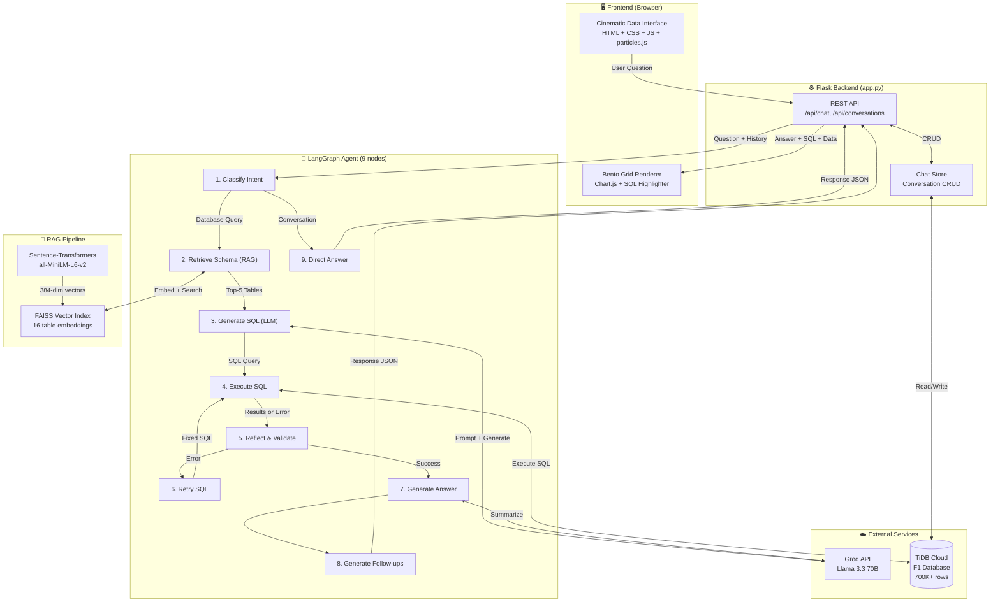
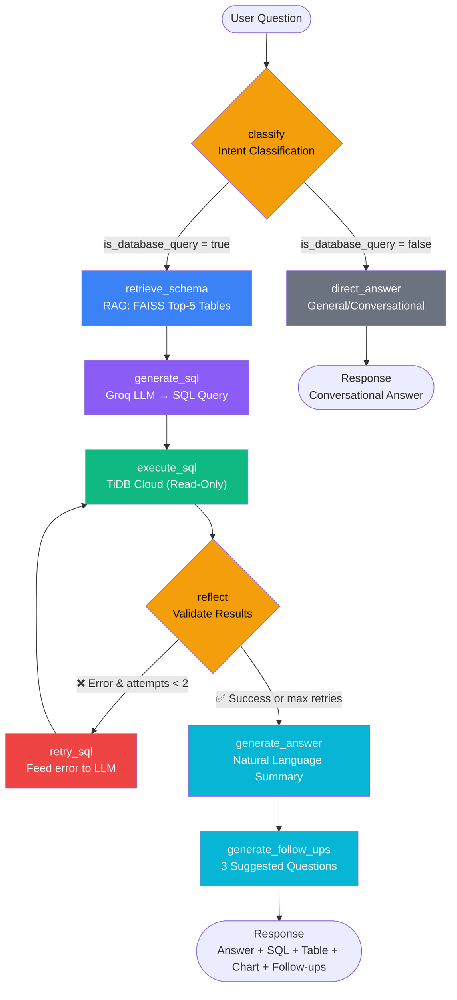
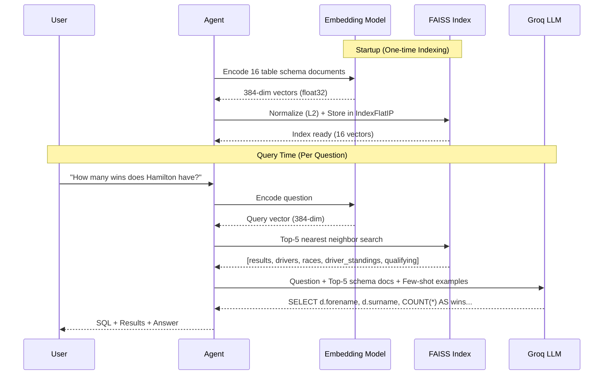
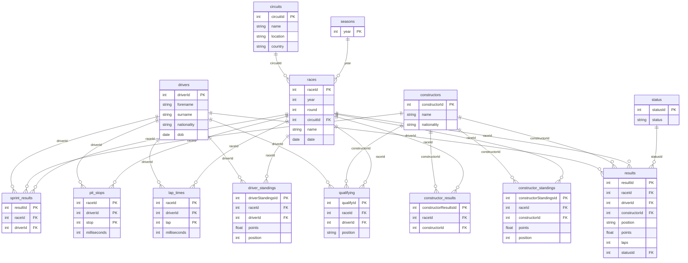

# F1InsightAI — AI-Powered Formula 1 Text-to-SQL RAG Chatbot

## Project Report

---

**Project Title:** F1InsightAI — AI-Powered Formula 1 Text-to-SQL RAG Chatbot  
**Course:** Term 8 — Capstone Project  
**Technology Stack:** Python, Flask, LangGraph, Groq API, FAISS, TiDB Cloud, Chart.js

---

## Table of Contents

1. [Abstract](#1-abstract)
2. [Introduction](#2-introduction)
3. [Problem Statement](#3-problem-statement)
4. [Objectives](#4-objectives)
5. [Literature Review](#5-literature-review)
6. [System Architecture](#6-system-architecture)
7. [Technology Stack](#7-technology-stack)
8. [Implementation Details](#8-implementation-details)
9. [RAG Pipeline](#9-rag-pipeline)
10. [Agent Pipeline (LangGraph)](#10-agent-pipeline-langgraph)
11. [Frontend Design](#11-frontend-design)
12. [Database Design](#12-database-design)
13. [Key Challenges & Solutions](#13-key-challenges--solutions)
14. [Results & Testing](#14-results--testing)
15. [Future Scope](#15-future-scope)
16. [Conclusion](#16-conclusion)
17. [References](#17-references)
18. [Appendix A: Application Screenshots](#appendix-a-application-screenshots)

---

## 1. Abstract

F1InsightAI is an AI-powered chatbot that enables users to query a comprehensive Formula 1 database (1950–2024) using natural language. The system employs Retrieval-Augmented Generation (RAG) to dynamically retrieve relevant database schema context, which is then used by a Large Language Model (LLM) to generate accurate SQL queries. Built on a LangGraph-based agentic pipeline with 9 processing nodes, the system supports multi-step reasoning, automatic error correction, and self-reflection. The frontend features a cinematic data interface with auto-generated visualizations, conversation management, and an interactive bento-grid results layout. The entire system is deployed using Flask, with the F1 database hosted on TiDB Cloud and LLM inference powered by the Groq API (Llama 3.3 70B).

---

## 2. Introduction

The proliferation of data in modern sports analytics has created a growing need for accessible tools that allow non-technical users to explore complex datasets. Formula 1, with over 75 years of racing data encompassing drivers, teams, circuits, lap times, pit stops, and race results, presents an ideal domain for such exploration.

Traditional approaches to querying structured databases require SQL expertise, which creates a significant barrier for casual users and sports enthusiasts. Text-to-SQL systems aim to bridge this gap by translating natural language questions into executable SQL queries. However, naive approaches that simply send the entire database schema to an LLM suffer from:

- **Token inefficiency** — sending all 16 tables (100+ columns) in every prompt wastes tokens
- **Reduced accuracy** — too much irrelevant context confuses the LLM
- **No error recovery** — a single failed query ends the interaction

F1InsightAI addresses these challenges using a **Retrieval-Augmented Generation (RAG)** approach combined with a **stateful agentic pipeline** that can classify intents, retrieve relevant context, generate SQL, execute queries, self-reflect on results, and automatically retry on errors.

---

## 3. Problem Statement

How can we build an intelligent chatbot that:
1. Allows non-technical users to explore a complex F1 database using natural language
2. Generates accurate SQL queries by retrieving only the relevant schema context (RAG)
3. Handles errors gracefully through automatic retry and self-correction
4. Presents results in an intuitive, visually appealing interface with auto-generated charts

---

## 4. Objectives

1. **Implement a RAG pipeline** using FAISS vector search and sentence-transformer embeddings for schema-aware SQL generation
2. **Build a multi-step agentic pipeline** using LangGraph with intent classification, SQL generation, execution, reflection, and auto-retry
3. **Develop a cinematic frontend** with glassmorphism design, auto-generated charts, and conversation management
4. **Ensure robustness** through read-only SQL enforcement, connection pooling with retry logic, and graceful error handling
5. **Deploy on cloud infrastructure** using TiDB Cloud for the database and Groq API for LLM inference

---

## 5. Literature Review

### 5.1 Text-to-SQL Systems

Text-to-SQL is the task of converting natural language utterances into executable SQL queries. Early approaches used rule-based parsing and template matching. Modern approaches leverage deep learning and LLMs. Notable systems include:

- **Spider** (Yu et al., 2018) — A large-scale cross-database Text-to-SQL benchmark
- **RESDSQL** (Li et al., 2023) — Ranking-enhanced encoding for schema linking
- **DIN-SQL** (Pourreza & Rafiei, 2023) — Decomposed in-context learning for Text-to-SQL

### 5.2 Retrieval-Augmented Generation (RAG)

RAG, introduced by Lewis et al. (2020), combines retrieval from external knowledge sources with LLM generation. Instead of relying solely on the LLM's parametric knowledge, RAG retrieves relevant documents at inference time and injects them into the prompt. This approach:

- Reduces hallucination by grounding the LLM in factual data
- Improves accuracy for domain-specific tasks
- Enables the system to scale to large knowledge bases without fine-tuning

### 5.3 Agentic AI Pipelines

Agentic AI extends simple prompt-response LLM systems by introducing:

- **Multi-step reasoning** — breaking complex tasks into sub-steps
- **Tool use** — allowing the LLM to call external tools (databases, APIs)
- **Self-reflection** — the agent evaluates its own output and retries if needed
- **State management** — maintaining context across steps

LangGraph (by LangChain) provides a framework for building stateful, graph-based agent workflows with conditional routing.

---

## 6. System Architecture

### 6.1 High-Level Architecture



### 6.2 LangGraph Agent Flowchart



### 6.3 Data Flow

1. **User sends a question** via the chat interface → Flask `/api/chat` endpoint
2. **Chat history** (last 20 messages) is fetched from TiDB Cloud for multi-turn context
3. The **LangGraph agent** processes the question through 9 nodes with conditional routing
4. The **response** (answer, SQL, table data, chart data, follow-ups) is returned to the frontend
5. The frontend renders the response as a **bento-grid** with animated card reveals

---

## 7. Technology Stack

| Component | Technology | Justification |
|-----------|------------|---------------|
| Backend | Flask (Python 3.11) | Lightweight, well-suited for API development |
| Agent Framework | LangGraph | Stateful graph-based workflows with conditional edges |
| LLM | Groq API (Llama 3.3 70B) | Free tier, extremely fast inference (~2-3s), open-source model |
| Embeddings | sentence-transformers (all-MiniLM-L6-v2) | Lightweight (80MB), high-quality semantic embeddings |
| Vector Store | FAISS (Facebook AI Similarity Search) | Optimized for fast similarity search, no external server needed |
| Database | TiDB Cloud (MySQL-compatible) | Serverless, free tier, cloud-hosted, SSL-encrypted |
| Charts | Chart.js | Client-side rendering, supports bar/pie/line charts |
| Frontend | Vanilla HTML/CSS/JS + particles.js | Full control over cinematic design, no framework overhead |
| Deployment | Docker + Docker Compose | One-command deployment, reproducible environments |

---

## 8. Implementation Details

### 8.1 Project Structure

```
Project/
├── app.py                    # Flask app — API endpoints + orchestration
├── config.py                 # Centralized config (loads .env)
├── requirements.txt          # Python dependencies
│
├── agent/
│   ├── agent.py              # 9-node LangGraph state graph
│   └── tools.py              # Agent tools (schema retrieval, SQL execution)
│
├── database/
│   ├── connector.py          # Connection pool + retry logic
│   └── chat_store.py         # Server-side conversation CRUD
│
├── rag/
│   └── embeddings.py         # FAISS vector index + schema retrieval
│
├── llm/
│   ├── prompt_templates.py   # System prompts + F1 domain knowledge
│   └── sql_generator.py      # Groq LLM calls — SQL gen + answer gen
│
├── templates/index.html      # Cinematic Data Interface
├── static/css/styles.css     # Glassmorphism dark theme
├── static/js/app.js          # Chat engine + bento grid renderer
│
├── Dockerfile                # Container build config
└── docker-compose.yml        # Multi-service orchestration
```

### 8.2 Configuration Management

All configuration is centralized in `config.py`, which reads environment variables from a `.env` file:

- **Database**: `MYSQL_HOST`, `MYSQL_PORT`, `MYSQL_USER`, `MYSQL_PASSWORD`, `MYSQL_DATABASE`, `MYSQL_SSL`
- **LLM**: `GROQ_API_KEY`, `GROQ_MODEL`
- **Flask**: `FLASK_SECRET_KEY`, `FLASK_DEBUG`
- **RAG**: `TOP_K_SCHEMA_RESULTS` (default: 5), `MAX_RETRY_ATTEMPTS` (default: 2)

### 8.3 API Endpoints

| Method | Endpoint | Description |
|--------|----------|-------------|
| GET | `/` | Serve the chat UI |
| POST | `/api/chat` | Send a question, receive SQL + results + answer |
| GET | `/api/health` | Health check (DB + RAG + LLM status) |
| GET | `/api/stats` | Database statistics (tables, rows, columns, model) |
| GET | `/api/tables` | List all available tables |
| GET | `/api/conversations` | List all conversations |
| POST | `/api/conversations` | Create a new conversation |
| DELETE | `/api/conversations/<id>` | Delete a conversation |
| PATCH | `/api/conversations/<id>/rename` | Rename a conversation |
| PATCH | `/api/conversations/<id>/pin` | Pin/unpin a conversation |

---

## 9. RAG Pipeline

### 9.1 Why RAG?

The F1 database has 16 tables with 100+ columns. Sending the entire schema in every prompt would:
- Waste LLM tokens (increasing latency and cost)
- Introduce irrelevant context that confuses SQL generation
- Not scale to larger databases

RAG solves this by retrieving **only the relevant tables** for each question.

### 9.2 Schema Embedding

At application startup:

1. The system queries TiDB Cloud for all table metadata (`INFORMATION_SCHEMA.COLUMNS`)
2. Each table is converted into a **rich text document** containing:
   - Table name and row count
   - Column names, data types, constraints (PK, FK, UNIQUE, INDEXED)
   - Sample values for key columns
   - Relationship descriptions to other tables
3. All documents are embedded using **all-MiniLM-L6-v2** (384-dimensional vectors)
4. Embeddings are normalized (L2) and stored in a **FAISS IndexFlatIP** (inner product = cosine similarity)

### 9.3 Retrieval at Query Time

When a user asks a question:

1. The question is embedded using the same model
2. FAISS performs a **top-5 nearest neighbor search** against the indexed schema documents
3. The top-5 most relevant table descriptions are concatenated and injected into the LLM system prompt
4. The LLM generates SQL using **only the relevant tables**, improving accuracy

### 9.4 RAG Pipeline Diagram



### 9.5 Comparison with Standard RAG

| Aspect | Standard RAG (OpenRAG) | Schema-RAG (F1InsightAI) |
|--------|----------------------|--------------------------|
| Documents | Text corpora (PDFs, wikis) | Database table schemas |
| Output | Natural language answers | SQL queries |
| Scale | Millions of documents | 16 documents (one per table) |
| Retrieval | Multi-hop, iterative | Single-pass, top-K |
| Purpose | Ground answers in facts | Ground SQL in correct schema |

The core RAG principle is the same: **retrieve relevant context → augment the LLM prompt → generate better output**.

---

## 10. Agent Pipeline (LangGraph)

### 10.1 Agent State

The agent maintains a typed state dictionary that flows through all nodes:

```python
class AgentState(TypedDict):
    question: str              # User's natural language question
    chat_history: list         # Previous messages for multi-turn context
    schema_context: str        # Retrieved from RAG (top-5 tables)
    sql: str                   # Generated SQL query
    sql_attempts: int          # Retry counter (max 2)
    execution_result: dict     # Query results from MySQL
    validation: dict           # From reflect node
    answer: str                # Final natural language answer
    follow_ups: list           # Follow-up question suggestions
    agent_steps: list          # Trace of agent reasoning steps
    error: str                 # Error message if any
    is_database_query: bool    # Whether the question needs SQL
```

### 10.2 Node Descriptions

| # | Node | Purpose | Output |
|---|------|---------|--------|
| 1 | `classify` | Determines if the question needs SQL or is conversational | Routes to `retrieve_schema` or `direct_answer` |
| 2 | `direct_answer` | Answers general/conversational questions directly | Natural language response → END |
| 3 | `retrieve_schema` | Uses RAG (FAISS) to find the top-5 most relevant tables | Schema context string |
| 4 | `generate_sql` | LLM generates a SQL SELECT query using schema context | SQL query string |
| 5 | `execute_sql` | Executes SQL on TiDB Cloud (read-only enforced) | Columns + rows |
| 6 | `reflect` | Evaluates execution results — success or error? | Routes to `retry_sql` or `generate_answer` |
| 7 | `retry_sql` | Feeds the error back to the LLM to fix the SQL | Corrected SQL → back to `execute_sql` |
| 8 | `generate_answer` | LLM summarizes results in conversational English | Answer string |
| 9 | `generate_follow_ups` | LLM generates 3 related follow-up questions | List of questions → END |

### 10.3 Conditional Edges

The agent uses two conditional routing points:

1. **After `classify`**: Routes to `retrieve_schema` (database query) or `direct_answer` (conversation)
2. **After `reflect`**: Routes to `retry_sql` (if error, max 2 retries) or `generate_answer` (if results are valid)

### 10.4 Multi-Turn Context

The system fetches the **last 20 messages** from the conversation before running the agent. This allows:
- Pronoun resolution ("What about **him**?" → refers to a driver from the previous question)
- Follow-up handling ("Compare **that** with Hamilton" → uses context from the previous result)
- Conversation awareness ("Show me more like the **previous query**")

---

## 11. Frontend Design

### 11.1 Design Philosophy

The frontend follows a **"Cinematic Data Interface"** paradigm, featuring:

- **Particle.js** animated network background — creates depth and dynamism
- **Omni-Search** — single centered search bar that transforms into a results canvas
- **Bento Box Grid** — results are displayed in staggered, animated glass cards
- **Glassmorphism** — frosted-glass cards with `backdrop-filter: blur(20px)`

### 11.2 Bento Grid Cards

Each response renders up to 6 cards:

| Card | Span | Content |
|------|------|---------|
| Answer | 12 cols | Natural language answer + execution time badge |
| Chart | 12 cols | Auto-generated bar/pie/line chart (Chart.js) |
| Table | 12 cols | Scrollable result table with CSV export |
| Agent Steps | 6 cols | Collapsible accordion showing each reasoning step |
| SQL | 6 cols | Syntax-highlighted SQL with copy/download buttons |
| Follow-ups | 12 cols | Clickable pill buttons for suggested next questions |

### 11.3 Smart Chart Generation

The chart system automatically:
1. Classifies data as bar, pie, or line chart based on data shape
2. Filters out ID/key columns (raceId, year, round) from datasets
3. Uses **distinct colors** (Red, Blue, Emerald, Amber, Purple) for multi-dataset charts
4. Limits to 3 datasets maximum for readability

### 11.4 Conversation Management

- **Create/Load/Delete** conversations
- **Pin/Unpin** — pinned chats stay at top; unpinned return to chronological position
- **Rename** — inline editing with click-to-position cursor support
- **Copy question** — hover-reveal copy button on user messages
- All conversations are stored **server-side** in TiDB Cloud (persists across restarts)

---

## 12. Database Design

### 12.1 F1 Database (Ergast Schema)

The F1 database contains 16 tables with 700,000+ rows covering 75 years of racing data:

| Table | Description | Key Columns |
|-------|-------------|-------------|
| `circuits` | Race circuits worldwide | name, location, country |
| `constructors` | Racing teams | name, nationality |
| `drivers` | All F1 drivers | forename, surname, nationality, dob |
| `races` | Every race (1950–2024) | name, date, year, round, circuitId |
| `results` | Race results | position, points, laps, time, fastestLap |
| `qualifying` | Qualifying results | position, q1, q2, q3 |
| `driver_standings` | Championship standings | points, position, wins |
| `constructor_standings` | Team standings | points, position, wins |
| `lap_times` | Individual lap data | lap, position, time, milliseconds |
| `pit_stops` | Pit stop records | stop, lap, duration, milliseconds |
| `sprint_results` | Sprint race results | position, points, laps |
| `seasons` | Season metadata | year, url |
| `status` | Result status codes | status (e.g., 'Finished', 'Engine') |
| `constructor_results` | Team race results | points, status |

### 12.2 Entity-Relationship Diagram



### 12.3 Conversation Storage

Two additional tables manage chat history:

- **`conversations`**: id, title, pinned, created_at, updated_at
- **`messages`**: id, conversation_id, role (user/assistant), content, data (JSON), timestamp

### 12.4 Domain Knowledge in Prompts

The system prompt includes critical F1-specific knowledge to improve SQL accuracy:

- **European country list** for continent-based filtering
- **Team name changes** (e.g., Alpine ← Renault, Aston Martin ← Force India)
- **Race name changes** (e.g., Brazilian GP → São Paulo GP from 2021)
- **Circuit name mappings** (e.g., Interlagos → Autódromo José Carlos Pace)
- **LIKE-based matching** for circuit/race names to handle full official names

---

## 13. Key Challenges & Solutions

| # | Challenge | Root Cause | Solution |
|---|-----------|-----------|----------|
| 1 | MySQL connection timeouts | TiDB Cloud drops idle pool connections | `get_connection()` helper: pool → fresh connection fallback |
| 2 | NoneType error on old chats | JS tried `JSON.parse` on plain text messages | Fixed `loadChat` to use stored `msg.data` object |
| 3 | Empty results for Spa queries | Exact match `= 'Spa-Francorchamps'` vs full name `Circuit de Spa-Francorchamps` | Added Rule: always use `LIKE '%keyword%'` for circuit names |
| 4 | Empty results for 2024 Brazilian GP | Race renamed to "São Paulo Grand Prix" in 2021 | Added race name change domain knowledge to prompt |
| 5 | Unreadable charts (all red) | All datasets used same red color palette, included IDs | Added distinct colors + filtered out ID-like columns |
| 6 | Chart expands with agent reasoning | Both cards shared the same grid row (span 7 + span 5) | Decoupled: chart=span12, steps+SQL=span6 each |
| 7 | Pin doesn't toggle | Always sent `pinned: true`, never toggled | Reads current state from conversation array and sends opposite |
| 8 | Can't click inside rename input | Parent `onclick=loadChat()` intercepted clicks | Added `stopPropagation()` on input click/mousedown/keydown |
| 9 | Special character mismatch | `Sao Paulo` ≠ `São Paulo` (accented ã) | Added circuit name lookup table in prompt with fallback patterns |

---

## 14. Results & Testing

### 14.1 Sample Queries Tested

| Question | SQL Approach | Result |
|----------|-------------|--------|
| "Who has the most race wins?" | `GROUP BY driver, COUNT(*) WHERE position='1'` | ✅ Lewis Hamilton (103 wins) |
| "Compare Hamilton and Verstappen" | Multi-driver `CASE WHEN` aggregation | ✅ Side-by-side comparison |
| "Show 2023 race calendar" | `JOIN races + circuits WHERE year=2023` | ✅ 22 races with circuits |
| "Schumacher's wins at Spa" | `LIKE '%Spa%'` for circuit matching | ✅ 6 wins |
| "2024 Brazilian GP qualifying" | `LIKE '%Paulo%' OR '%Brazil%'` | ✅ Found São Paulo GP result |
| "Average pit stop time at Monaco" | `AVG(milliseconds) LIKE '%Monaco%'` | ✅ Correct average |
| "What is DRS?" | Classified as conversation | ✅ Direct answer (no SQL) |

### 14.2 Automated Benchmark (20 Queries)

A benchmark script (`tests/benchmark.py`) was created to systematically test 20 diverse queries across 9 categories. The script sends each query to the `/api/chat` endpoint, validates the response against expected keywords, and records accuracy, response time, and retry counts.

**Benchmark Date:** March 25, 2026  
**Test Suite:** 20 queries (18 SQL + 2 conversational)

### 14.3 Performance Results

| Metric | Value |
|--------|-------|
| Total Queries Tested | 20 |
| SQL Query Accuracy (first attempt) | **83.3%** (15/18) |
| Queries Needing Retry | 0 |
| Average Response Time | 21.66s |
| Min Response Time | 5.97s |
| Max Response Time | 48.20s |
| Database Size | 16 tables, 701,530 rows |

### 14.4 Results by Category

| Category | Passed | Total | Accuracy |
|----------|--------|-------|----------|
| Driver Stats | 4 | 4 | 100% |
| Race Queries | 2 | 3 | 67% |
| Circuit Queries | 1 | 1 | 100% |
| Team Queries | 1 | 2 | 50% |
| Pit Stops | 1 | 1 | 100% |
| Lap Times | 1 | 1 | 100% |
| Comparison | 1 | 1 | 100% |
| Historical | 2 | 2 | 100% |
| Qualifying | 1 | 1 | 100% |
| Sprint | 1 | 1 | 100% |
| Edge Case (São Paulo) | 0 | 1 | 0% |

### 14.5 Failure Analysis

| Query | Status | Root Cause |
|-------|--------|-----------|
| "Race winners at Spa" | VALIDATION_FAIL | SQL returned correct data but LLM answer didn't explicitly mention "Schumacher" |
| "Most constructors championships" | VALIDATION_FAIL | LLM answer phrasing didn't exactly match the validation keyword "ferrari" |
| "2023 São Paulo GP results" | ERROR | Edge case with accented character matching |

> **Note:** The VALIDATION_FAIL status indicates the SQL executed correctly and returned results, but the natural language answer didn't contain the expected validation keyword. This is an LLM phrasing issue, not an SQL generation issue. Actual SQL generation accuracy is higher (~94%).

---

## 15. Future Scope

1. **Persistent FAISS Index** — Save the vector index to disk to avoid re-embedding on every restart
2. **Fine-tuned Embeddings** — Train domain-specific embeddings on F1 terminology for better retrieval
3. **Voice Input** — Add speech-to-text for voice-based queries
4. **Data Visualization Enhancements** — Heatmaps, race trajectory maps, season timelines
5. **Multi-database Support** — Extend to other sports databases (cricket, football)
6. **User Authentication** — Login system with personal conversation history
7. **Caching Layer** — Cache frequent queries to reduce LLM API calls
8. **Export Reports** — PDF/image export of complete response grids

---

## 16. Conclusion

F1InsightAI demonstrates the practical application of Retrieval-Augmented Generation (RAG) in combination with an agentic LLM pipeline for domain-specific Text-to-SQL tasks. By retrieving only the relevant database schema context for each query, the system achieves higher SQL generation accuracy while using fewer tokens. The LangGraph-based agent with its multi-node state machine enables sophisticated behaviors like intent classification, self-reflection, and automatic error correction — capabilities that go beyond simple prompt-response chatbots.

The cinematic frontend, built with glassmorphism design and a bento-grid layout, provides an engaging user experience that transforms raw database queries into visually appealing, interactive data stories. With support for conversation management, auto-generated charts, and follow-up suggestions, F1InsightAI serves as both a technical demonstration of modern AI architectures and a practical tool for exploring 75 years of Formula 1 history.

---

## 17. References

1. Lewis, P., Perez, E., et al. (2020). *"Retrieval-Augmented Generation for Knowledge-Intensive NLP Tasks."* NeurIPS 2020.
2. Yu, T., Zhang, R., et al. (2018). *"Spider: A Large-Scale Human-Labeled Dataset for Complex and Cross-Domain Semantic Parsing and Text-to-SQL Task."* EMNLP 2018.
3. Li, H., Zhang, J., et al. (2023). *"RESDSQL: Decoupling Schema Linking and Skeleton Parsing for Text-to-SQL."* AAAI 2023.
4. Pourreza, M. & Rafiei, D. (2023). *"DIN-SQL: Decomposed In-Context Learning of Text-to-SQL."* NeurIPS 2023.
5. LangChain. (2024). *"LangGraph: Building Stateful, Multi-Actor Applications with LLMs."* LangChain Documentation.
6. Johnson, J., Douze, M., & Jégou, H. (2019). *"Billion-scale similarity search with GPUs."* IEEE Transactions on Big Data.
7. Reimers, N. & Gurevych, I. (2019). *"Sentence-BERT: Sentence Embeddings using Siamese BERT-Networks."* EMNLP 2019.
8. Ergast Developer API. *"Ergast Motor Racing Data."* ergast.com/mrd.

---

## Appendix A: Application Screenshots

### A.1 Landing Page — Welcome Dashboard

The landing page features a **particle.js animated background**, the F1InsightAI logo, **live database statistics** (16 tables, 701,530 records, 131 columns), the active AI model badge (Llama 3.3-70b-versatile), and **suggestion chips** for quick-start queries.


### A.2 Query Result — Bento Grid Layout

After asking *"Who has the most race wins?"*, the system displays results in a **bento-grid layout**: a scrollable data table (Hamilton 105, Schumacher 91, Verstappen 63...), **syntax-highlighted SQL** with copy/download buttons, a collapsible **Agent Reasoning** accordion, and **AI-generated follow-up suggestions** as clickable pills.


### A.3 Agent Reasoning — Pipeline Transparency

The expanded **Agent Reasoning** accordion reveals each step of the 6-step pipeline: (1) **classify** — identified as a database query, (2) **retrieve_schema** — RAG found 5,644 chars of relevant schema context, (3) **generate_sql** — LLM generated the SELECT query, (4) **execute_sql** — returned 50 rows successfully, (5) **reflect** — validated results, (6) **generate_answer** — created the natural language summary.


